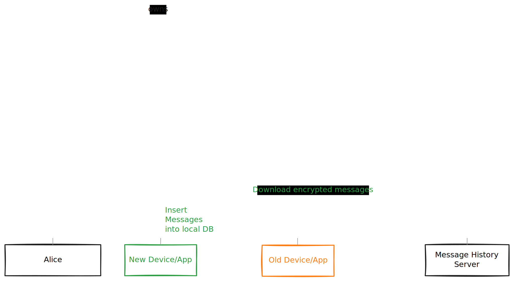

# XMTP Message History Server

A simple, asynchronous file server provided as an example to support XMTP Message History transfers.

Running this server allows XMTP service providers to provide the ability for users to securely upload message history bundles via a `POST` request and retrieve them via a `GET` request from another authorized app or device, using a unique ID assigned upon upload.

It is expected that these uploaded bundles should be: encrypted, short-lived, and non-guessable.



## Getting started

### Prerequisites

#### Rust

Rust and Cargo can be installed from [https://rustup.rs](https://rustup.rs).

#### Node

Node is required to run the example client scripts.

Please make sure you have a compatible version as specified in `examples/.node-version`. We recommend using a Node version manager such as [nvm](https://github.com/nvm-sh/nvm) or [nodenv](https://github.com/nodenv/nodenv).

### Install

Clone the repository to your local machine:

```bash
git clone https://github.com/xmtp/xmtp-message-history-server.git
cd xmtp-message-history-server
```

Build the project:

```bash
cargo build
```

Run the server:

```bash
cargo run
```

The server will start running on http://0.0.0.0:5558.

## Usage

### Upload a file

To upload a file, send a POST request to http://0.0.0.0:5558/upload with the file data in the request body.

The server will return a unique ID for the uploaded file.

Example using cURL:

```bash
curl -X POST http://0.0.0.0:5558/upload --data "@./examples/test_file.txt"
```

### Retrieve a file

Send a GET request to http://0.0.0.0:5558/files/{id}, where {id} is the unique ID returned by the server during the upload.

Example using cURL:

```bash
curl http://0.0.0.0:5558/files/{id} --output test_file.txt
```

### Example

An example set of Node scripts are available in the `examples/` folder demonstrating the upload and download of a file.

#### Upload file

```bash
node upload.js
```

This script will output the bundle ID, which can be used to download the file.

Example output:

```
Uploading file test_file.txt with content: Hello, world!
File uploaded successfully
Bundle ID: aabbc983-0f0e-4fc8-911f-d4e669e48237
Run "BUNDLE_ID=aabbc983-0f0e-4fc8-911f-d4e669e48237 node download.js" to download the file
```

#### Download file

Using the bundle ID from the previous step:

```bash
BUNDLE_ID=aabbc983-0f0e-4fc8-911f-d4e669e48237 node download.js
```

## Contributing

See our [contribution guide](./CONTRIBUTING.md) to learn more about contributing to this project.
